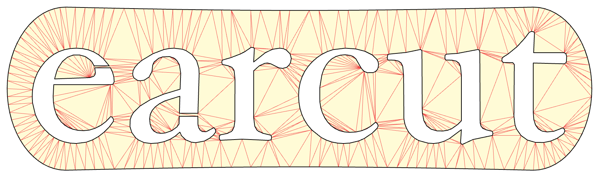

## Earcut

A fast, [header-only](https://github.com/mapbox/earcut.hpp/blob/master/include/mapbox/earcut.hpp) C++ port of [earcut.js](https://github.com/mapbox/earcut), the fastest and smallest JavaScript polygon triangulation library.
[](https://github.com/mapbox/earcut.hpp/actions/workflows/build.yml)
[](https://github.com/mourner/projects)



Earcut favors raw speed and simplicity over triangulation quality, while being robust enough to handle most practical datasets without crashing or producing garbage, with an option to [refine](#refinement-optional-delaunay-post-pass) the result to [Delaunay](https://en.wikipedia.org/wiki/Delaunay_triangulation) quality at a small cost. Originally built for [Mapbox GL](https://www.mapbox.com/), it's a good fit for real-time triangulation of geographical shapes and other practical data.

It implements a modified ear slicing algorithm, optimized by [z-order curve](http://en.wikipedia.org/wiki/Z-order_curve) and spatial hashing and extended to handle holes, twisted polygons, degeneracies and self-intersections in a way that doesn't _guarantee_ correctness of triangulation, but attempts to always produce acceptable results for practical data. It's based on ideas from [FIST: Fast Industrial-Strength Triangulation of Polygons](http://www.cosy.sbg.ac.at/~held/projects/triang/triang.html) by Martin Held and [Triangulation by Ear Clipping](http://www.geometrictools.com/Documentation/TriangulationByEarClipping.pdf) by David Eberly.

## Usage

```cpp
#include <earcut.hpp>
```
```cpp
// A point is any type with x/y accessors; std::array works out of the box.
using Point = std::array<double, 2>;

// A polygon is a list of rings. The first ring is the outer boundary; the rest are holes.
// Winding order doesn't matter, and rings can be given in any order.
std::vector<std::vector<Point>> polygon = {
    {{100, 0}, {100, 100}, {0, 100}, {0, 0}},  // outer ring
    {{75, 25}, {75, 75}, {25, 75}, {25, 25}},  // hole
};

// The index type. Defaults to uint32_t; pass uint16_t if your data never exceeds 65536 vertices.
using N = uint32_t;

// Triangulate. The result is a flat list of indices into the input vertices (numbered ring after
// ring, so index 6 is {25, 75} here), three per triangle. Output triangles have a consistent
// winding regardless of the input: counter-clockwise in a y-up coordinate system (clockwise in
// y-down/screen space). Call std::reverse on the result if you need the opposite orientation.
std::vector<N> indices = mapbox::earcut<N>(polygon);
```

Earcut can triangulate a simple, planar polygon of any winding order including holes. It will even return a robust, acceptable solution for non-simple polygons. Earcut works on a 2D plane: only `x` and `y` are used, so if you have three or more dimensions, project them onto a 2D surface before triangulation, or use a more suitable library for the task (e.g. [CGAL](https://doc.cgal.org/latest/Triangulation_3/index.html)).

Any point type works as input — earcut reads coordinates through the `nth` accessor. Accessors for `std::tuple`, `std::pair`, and `std::array` ship by default; for a custom type (like Clipper's `IntPoint`), specialize `nth` for it:

```cpp
struct IntPoint { int64_t X, Y; };

namespace mapbox { namespace util {

template <> struct nth<0, IntPoint> { static auto get(const IntPoint& p) { return p.X; } };
template <> struct nth<1, IntPoint> { static auto get(const IntPoint& p) { return p.Y; } };

}} // namespace mapbox::util
```

The polygon and ring containers are just as flexible: any type that meets the [Container](https://en.cppreference.com/w/cpp/named_req/Container) requirements (`size()`, `empty()`, `operator[]`) works in place of `std::vector`.

### Refinement (optional Delaunay post-pass)

If triangle quality matters, `mapbox::refine` is an opt-in post-pass that legalizes every interior edge in place with Delaunay flips, converging toward the constrained Delaunay triangulation while preserving the polygon boundary and holes. It keeps the same number of triangles and the same index format, but usually removes many skinny triangles and reduces total triangle edge length. Being a post-process, it doesn't affect the speed of normal `earcut` calls unless you explicitly call it.

```cpp
std::vector<N> indices = mapbox::earcut<N>(polygon);

// coords is a random-access container of points indexed by vertex index — i.e. the input
// vertices concatenated ring after ring, in the same order earcut's returned indices refer to.
// indices is refined in place; the triangle count never changes.
mapbox::refine(indices, coords);
```

It assumes a valid manifold triangulation, such as the output of `earcut` (though any manifold triangle-index array works), and reads `coords` through the same `nth<0>`/`nth<1>` accessors. It doesn't repair invalid polygon input or make the mesh conforming. Note also that `refine` uses **non-robust** predicates: float input is fine, and the worst case is a not-quite-Delaunay edge, never an invalid mesh — but unlike `earcut` it does not promise bit-identical output across compilers.

## Performance

Earcut is heavily optimized for its primary workload — triangulating polygons from
[Mapbox Vector Tiles](https://github.com/mapbox/vector-tile-spec). On a representative benchmark of
**119,680 real-world polygons** (1.9M vertices) drawn from a window of map tiles through zooms 4–16,
it triangulates the whole set in **~276 ms** on a MacBook Pro M1 Pro (2021) — noticeably faster than
the JS original — with optional Delaunay refinement taking an additional **~98 ms**. You can run the
benchmark yourself with `./build/bench`.

## Robustness

Earcut does **not** guarantee a correct triangulation on arbitrary input — it trades quality for
speed, aiming to always produce an acceptable result on practical data without crashing or emitting
garbage. The input is assumed to be a valid polygon: rings that don't self-cross or overlap, holes
that stay inside the outer ring, and no duplicate or zero-length edges. On input that breaks these
assumptions the result can be noticeably wrong (overlapping triangles, gaps, or triangles outside
the polygon), so clean your input first if correctness matters. For a guaranteed-correct
triangulation even on bad data, use a library like [CGAL](https://www.cgal.org/) or
[libtess2](https://github.com/memononen/libtess2) (slower and larger).

The output is also not _conforming_ — a vertex may land in the middle of another triangle's edge (a
T-junction). This is harmless for rendering but can break navmesh or FEM use; if you need a
conforming mesh, [remove T-junctions in a post-process](https://github.com/mapbox/earcut/issues/74#issuecomment-4826113682).

## Additional build instructions
In case you just want to use the earcut triangulation library; copy and include the header file [`<earcut.hpp>`](https://github.com/mapbox/earcut.hpp/blob/master/include/mapbox/earcut.hpp) in your project and follow the steps documented in the section [Usage](#usage).

If you want to build the test, benchmark and visualization programs instead, follow these instructions:

### Dependencies

Before you continue, make sure to have the following tools installed:
 * git ([Ubuntu](https://help.ubuntu.com/lts/serverguide/git.html)/[Windows/macOS](http://git-scm.com/downloads))
 * cmake 3.16+ ([Windows/macOS/Linux](https://cmake.org/download/))
 * A C++17 compiler (GCC 9+, Clang 10+, or MSVC 2019+)

The test/benchmark dependencies (GoogleTest, Google Benchmark, and — for the visualizer — GLFW),
as well as the test fixtures, are fetched automatically at configure time via CMake's `FetchContent`,
so a plain (non-recursive) clone is all you need. The first configure needs network access to clone
them; set `FETCHCONTENT_FULLY_DISCONNECTED=ON` (or point `FETCHCONTENT_SOURCE_DIR_<name>` at a local
checkout) to build offline. The visualizer additionally needs an OpenGL SDK and is off by default.

### Compilation

```bash
git clone https://github.com/mapbox/earcut.hpp.git
cd earcut.hpp
cmake -B build -DCMAKE_BUILD_TYPE=Release
cmake --build build -j
# ./build/tests
# ./build/bench
```

Build options (all default to their common value): `-DEARCUT_BUILD_TESTS=ON`,
`-DEARCUT_BUILD_BENCH=ON`, `-DEARCUT_BUILD_VIZ=OFF` (needs OpenGL + GLFW),
`-DEARCUT_WARNING_IS_ERROR=OFF`.

CMake can also generate IDE projects (Visual Studio, Xcode, etc.) — e.g.
`cmake -B build -G "Visual Studio 17 2022"` — or import the folder directly in CLion / VS.

### Visualizer

There's an interactive OpenGL viewer for inspecting the triangulation of the bundled test fixtures.
It's off by default (it needs an OpenGL SDK and GLFW); enable and run it with:

```bash
cmake -B build -DCMAKE_BUILD_TYPE=Release -DEARCUT_BUILD_VIZ=ON
cmake --build build --target viz -j
./build/viz
```

Controls: **←/→** switch fixture, **↑/↓** switch tessellator (earcut / earcut + refine / scanline fill),
**F/M/O** toggle fill/mesh/outline, **WASD** pan, **+/−** or scroll to zoom, **R** reset, **Q**/**Esc** quit.

## Status

This is currently based on [earcut 3.2.3](https://github.com/mapbox/earcut/releases/tag/v3.2.3).
